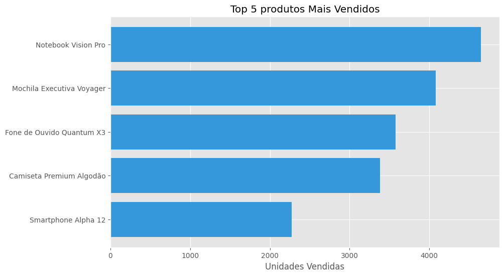

# Análise de Vendas - Microsoft DP-100

## Objetivo 

Identificar padrões de vendas, impacto de promoções e relação entre avaliação de clientes e desempenho de produtos.

## Processo 
 <ol>
    <li><strong>Coleta de Dados do arquivo CSV</strong></li>
    <li>
        <strong>
        Análise Exploratória: 
        - Top 5 produtos mais vendidos. 
        - Impacto de promoções nas vendas. 
        - Tendência sazonal simulada.
    </li>
    <li>Visualizações: Gráficos de barras e dispersão</li>
    </strong>
 <ol>

## Insights 

    - **Promoções aumentam vendas**:  Produtos em promoção venderam em média **2x mais**. 
- **Avaliação ≠ Vendas**: Produtos com avaliação alta não são necessariamente os mais vendidos (ex: eletrônicos caros). 
- **Sazonalidade**: Pico de vendas em novembro/dezembro (Black Friday/Natal).

